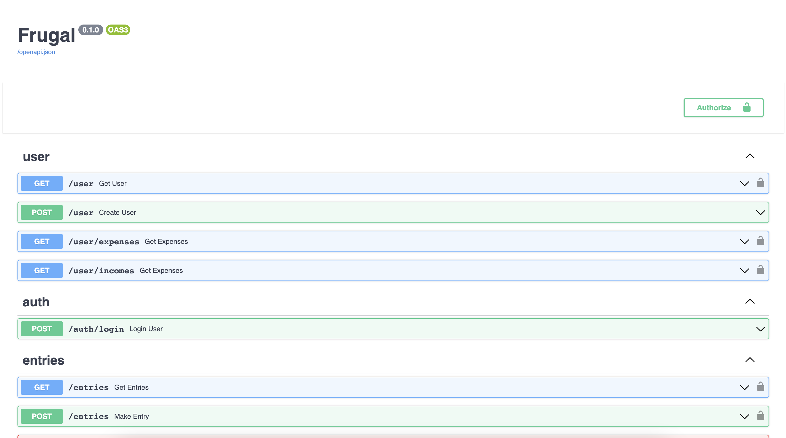
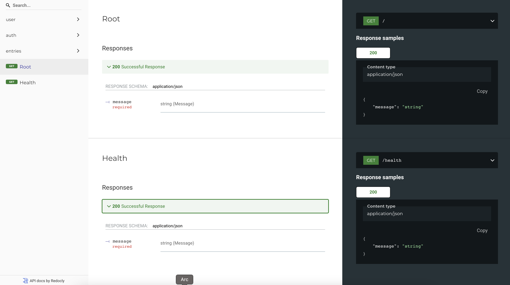

# Frugal - Finance Handling Application

### An API backend to manage finances 

## How to run

* Clone repo https://github.com/Sayanc2000/Finance_Tracker
* Use the [docker-compose](docker-compose.yaml) file to spin up the servers
* Use command `docker-compose up`
* This by default spins up [Dockerfile](Dockerfile) target=development image, along with a PostgreSQL server
* The PostgreSQL server is persistent through docker daemon restarts

## Core Application

The core application is built on [FastAPI](https://fastapi.tiangolo.com/). Package management is done
with [python-poetry](https://github.com/python-poetry/poetry) 
This is a highly static typed application, with the use of typing package wherever possible and well-defined schemas.

### Python-Poetry

Python poetry is a better way of handling requirements in your python project that using requirements.txt.
It is a npm like package manager. 

* The [pyproject.toml](pyproject.toml) file list down all the requirements for the project. 
* To install requirements use `poetry install`  
* To add new requirements use `poetry add <new-package>`

### Docker

* A multi-stage approach to Docker image generation is taken here
* Base image used
  is [python:3.9-slim](https://hub.docker.com/layers/library/python/3.9-alpine/images/sha256-fd9aff2415bea261013ea092965c22dfd502e3a284d319f9989321d8ef17e1b2)
* There are 4 build stages:
    1. python-base
    2. builder-base
    3. development
    4. production

The default target used here is development with uvicorn command. Production uses gunicorn command.

### Environment

Environment file needs to setup using a .env file. This file requires:

* `POSTGRES_URL=postgresql://postgres:postgres@db:5432/postgres`

## Images

